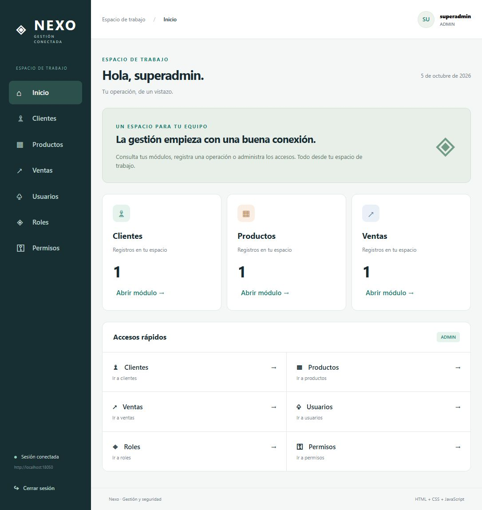

# NEXO · Frontend de gestión y seguridad

Interfaz responsive para el backend NEXO, construida exclusivamente con **HTML,
CSS y JavaScript**. Conecta usuarios, roles, permisos, clientes, productos y
ventas mediante una API REST con JWT. No requiere frameworks, paquetes npm,
CDN ni compilación.

## Inicio rápido

1. Inicia PostgreSQL y el backend en
   `D:\Spring Boot Proyectos\sguridad java 21\spring-security-user-role-management`.
2. Abre [index.html](index.html) en un navegador moderno o sirve esta carpeta
   con Live Server o un servidor estático.
3. En el login, despliega **Conexión al servidor** y configura la URL de la API.
   El valor inicial es `http://localhost:8050`, sin `/api` al final.
4. Inicia sesión con una cuenta del backend.

Si tienes Python instalado, puedes servir el frontend desde PowerShell:

```powershell
cd 'D:\Spring Boot Proyectos\sguridad java 21\Frontend'
python -m http.server 5500 --bind 127.0.0.1
```

Abre [http://127.0.0.1:5500](http://127.0.0.1:5500). Para detener el servidor,
pulsa Ctrl+C. Python solo sirve los archivos; no es una dependencia del frontend.

La cuenta inicial de desarrollo, si no fue modificada, es `superadmin` con
contraseña `SuperAdmin123!`. Estas credenciales son de la aplicación, no de
PostgreSQL. Consulta [el README del backend](../spring-security-user-role-management/README.md)
para configurar perfiles, bootstrap, base de datos y JWT.

## Conexión con el backend

| Configuración | Comportamiento |
| --- | --- |
| URL de la API | Editable desde el login; se conserva en localStorage |
| Login | POST /api/auth/login; recibe el JWT como texto |
| Sesión actual | GET /api/auth/me; obtiene rol y permisos efectivos |
| Peticiones protegidas | Cabecera Authorization: Bearer seguida del token |
| Vigencia del JWT | Configurada en el backend, en application-dev.properties |

El backend actualizado debe incluir `/api/auth/me`. Este endpoint permite
conocer los accesos propios sin conceder USER_READ. La interfaz no define
la clave JWT ni decide la duración de los tokens.

El servidor debe permitir CORS desde el origen del frontend. La configuración
actual de NEXO permite estas peticiones. Si publicas la interfaz por HTTPS,
la API también debe usar HTTPS para evitar bloqueos de contenido mixto.

## Pantallas y acciones

| Pantalla | Funciones |
| --- | --- |
| Inicio | Métricas de clientes, productos y ventas accesibles, y accesos rápidos |
| Clientes | Crear, consultar listado, editar y desactivar |
| Productos | Gestionar nombre, SKU, precio, existencias y estado |
| Ventas | Registrar operaciones, consultar historial y detalle, anular |
| Usuarios | Crear, editar, habilitar/bloquear, eliminar, cambiar rol y gestionar permisos individuales |
| Roles | Crear y consultar roles; agregar o retirar permisos heredados |
| Permisos | Consultar catálogo y crear nuevas autoridades |
| Mi espacio | Ver usuario, rol y permisos efectivos desde el botón del perfil |

Los listados comerciales usan páginas de 20 registros. **Buscar en esta página**
filtra solo los resultados cargados, no toda la base. Usuarios y catálogos se
cargan como listas. Los formularios se abren en diálogos y muestran los errores
devueltos por el servidor.

Eliminar una cuenta es permanente. Desactivar un cliente o producto conserva
su historial comercial. La interfaz solicita confirmación para estas acciones,
la retirada de permisos individuales desde el detalle y la anulación de ventas.

## Sesión y permisos

El token se guarda en `sessionStorage` durante la sesión de la pestaña; cerrar
sesión lo elimina. Recargar la página intenta recuperar la sesión y vuelve a
consultar `/api/auth/me`. No se guardan contraseñas; solo la URL de la API se
conserva en `localStorage`. No se carga código remoto.

La navegación y los botones dependen de los permisos efectivos recibidos del
backend. Los accesos se actualizan después de guardar cambios, al pulsar
**Actualizar** o al consultar **Mi espacio**. Una modificación realizada desde
otra sesión puede requerir actualizar la interfaz, aunque el servidor ya la
aplique a las siguientes peticiones.

| Módulo | Permisos utilizados |
| --- | --- |
| Usuarios | USER_READ, USER_CREATE, USER_UPDATE, USER_DELETE |
| Asignaciones individuales | ROLE_ASSIGN, PERMISSION_ASSIGN |
| Catálogos | ROLE_MANAGE, PERMISSION_MANAGE |
| Clientes | CUSTOMER_READ, CUSTOMER_CREATE, CUSTOMER_UPDATE, CUSTOMER_DELETE |
| Productos | PRODUCT_READ, PRODUCT_CREATE, PRODUCT_UPDATE, PRODUCT_DELETE |
| Ventas | SALE_READ, SALE_CREATE, SALE_CANCEL |

Un usuario con permisos de escritura sin lectura puede crear o realizar acciones
por username/ID. Sin acceso al catálogo de roles, puede introducir el nombre de
un rol existente. Sin acceso a clientes/productos, puede introducir sus IDs en
una venta. El backend valida siempre referencias, estados y permisos.

Un 401 en una petición protegida cierra la sesión; un 403 muestra el rechazo.
Si `/api/auth/me` devuelve 403, se cierra la sesión porque ya no puede recuperarse
el acceso actual. Ocultar botones nunca sustituye la autorización del servidor.
No existe renovación automática del token: al vencer, inicia sesión nuevamente.
Cerrar sesión en el frontend no revoca el JWT en el backend.

## Flujo de ejemplo: vendedor con permiso adicional

Con una cuenta ADMIN:

1. En **Roles**, crea VENDEDOR con CUSTOMER_READ, CUSTOMER_CREATE, PRODUCT_READ,
   SALE_READ y SALE_CREATE.
2. En **Usuarios**, crea una cuenta y asígnale VENDEDOR desde la acción **Rol**.
3. Usa **Dar permiso** para conceder SALE_CANCEL a esa cuenta si debe anular ventas.
4. Al entrar con esa cuenta se mostrarán los módulos y acciones correspondientes.

Cada usuario tiene un rol único. Cambiarlo conserva sus permisos individuales.
El detalle **Permisos** distingue heredados, individuales y efectivos. Retirar
un permiso individual no elimina una concesión equivalente heredada del rol.

En el catálogo **Roles**, gestionar permisos requiere ROLE_MANAGE y
PERMISSION_MANAGE. Los permisos base reservados de ADMIN y CUSTOMER no pueden
retirarse mediante la API. Crear un permiso nuevo no crea una funcionalidad:
su endpoint debe verificar esa autoridad en el backend.

## Flujo de una venta

1. Crea un cliente habilitado desde **Clientes**.
2. Crea un producto activo con precio positivo, SKU único y existencias.
3. En **Ventas → Nueva venta**, selecciona el cliente y agrega los productos.
4. Define cantidades y consulta el total estimado.
5. Pulsa **Registrar venta**. El servidor calcula el total definitivo y descuenta
   inventario de forma transaccional.
6. Usa **Ver detalle** para consultar precios y nombres históricos.
7. Si tienes SALE_CANCEL, usa **Anular** y confirma la operación.

SALE_CREATE permite registrar; CUSTOMER_READ y PRODUCT_READ facilitan los
selectores, pero no son obligatorios. PRODUCT_READ permite estimar importes;
el precio definitivo siempre se obtiene del backend. No se muestra símbolo
monetario porque el backend no define moneda.

La interfaz evita productos repetidos y admite hasta 100 líneas. Los selectores
usan registros activos del catálogo. La API valida cantidades, existencias,
referencias y límites. Anular repone inventario una sola vez y conserva el
historial. Cada envío de creación representa una venta nueva: si hay un corte
de conexión después de enviar, consulta el historial antes de repetirlo.

## Estructura y personalización

| Archivo | Responsabilidad |
| --- | --- |
| [index.html](index.html) | Login, navegación, estructura y diálogo reutilizable |
| [styles.css](styles.css) | Colores, tipografía, tablas, formularios y adaptación a pantallas pequeñas |
| [app.js](app.js) | Cliente HTTP, sesión, permisos, listados y acciones |
| [vista-previa.png](vista-previa.png) | Captura con datos de prueba |

En `app.js`, `sections` define los módulos, `api()` centraliza las peticiones y
`can()` consulta permisos efectivos. Para agregar un módulo, registra su sección,
la condición de visibilidad y sus formularios/listados, y conecta los endpoints
protegidos del backend. Los datos del servidor se escapan antes de incluirlos en
HTML. Mantén esa protección al extender las pantallas.

Los colores principales se definen con variables CSS en `:root`. El menú lateral
se adapta a pantallas pequeñas y se abre desde el botón de menú. La plantilla
utiliza fuentes del sistema y no necesita conexión a servicios externos.

## Problemas frecuentes

| Situación | Qué revisar |
| --- | --- |
| No se conecta al servidor | URL correcta, backend iniciado, puerto y PostgreSQL disponibles |
| Fallo CORS o contenido mixto | Origen permitido y compatibilidad HTTP/HTTPS entre frontend y API |
| No aparece un módulo o acción | Consulta Mi espacio y verifica el permiso correspondiente |
| Credenciales rechazadas | Usuario, contraseña y estados locked/disabled en el backend |
| Token no disponible | Inicia sesión otra vez; cambiar clave o emisor JWT invalida tokens anteriores |
| Rol o permiso inexistente | Crea primero la entrada en su catálogo y usa el nombre exacto |
| Producto duplicado o venta rechazada | SKU único, cantidades válidas, registros activos y stock suficiente |
| Búsqueda sin resultados | El filtro solo busca en la página cargada |

## Verificación

Comprobación de sintaxis, si tienes Node.js instalado:

```powershell
node --check app.js
```

Node.js no es necesario para utilizar la interfaz. Se verificaron en el navegador
login, creación de cliente y producto, registro y anulación de venta, y creación
de roles y permisos, contra un backend temporal con H2. No se guardaron esos datos
en PostgreSQL. Las pruebas de la seguridad y sesión se ejecutan en el proyecto
backend; aquí no se incluye una suite automatizada de pruebas del navegador.


